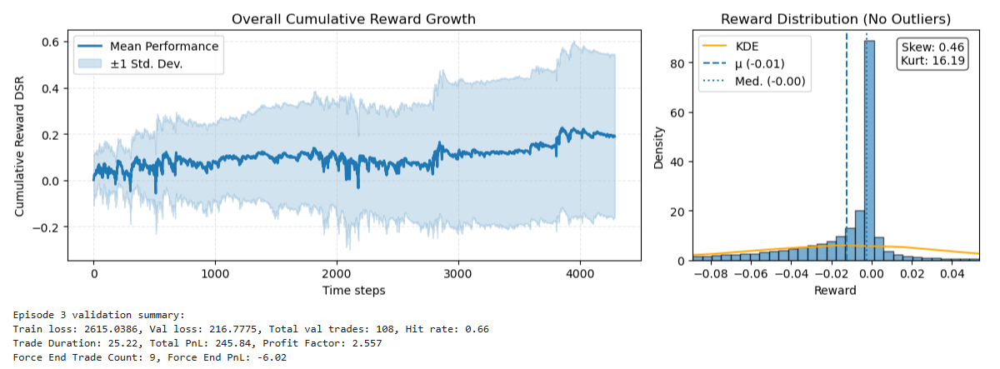
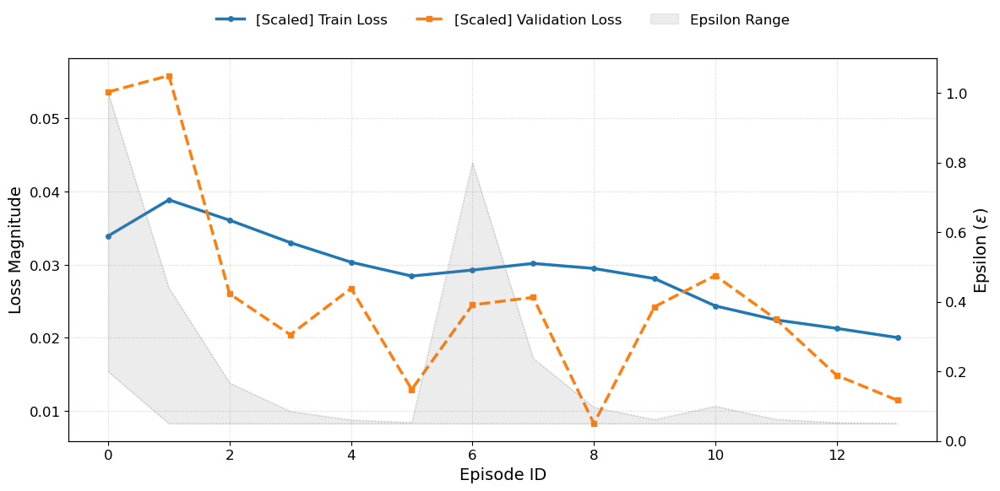

<a id="readme-top"></a>

<!-- PROJECT SHIELDS -->
[![Forks][forks-shield]][forks-url]
[![Stargazers][stars-shield]][stars-url]
[![Issues][issues-shield]][issues-url]
[![LinkedIn][linkedin-shield]][linkedin-url]


<!-- PROJECT LOGO -->
<br />
<div align="center">
  <a href="https://github.com/shh1v/ReinforceTrader">
    
  </a>

  <p align="center">
    <a href="https://github.com/shh1v/ReinforceTrader">View Demo</a>
    &middot;
    <a href="https://github.com/shh1v/ReinforceTrader/issues/new?labels=bug&template=bug-report---.md">Report Bug</a>
    &middot;
    <a href="https://github.com/shh1v/ReinforceTrader/issues/new?labels=enhancement&template=feature-request---.md">Request Feature</a>
  </p>
</div>


<!-- TABLE OF CONTENTS -->
<details>
  <summary>Table of Contents</summary>
  <ol>
    <li>
      <a href="#about-the-project">About The Project</a>
      <ul>
        <li><a href="#data-preprocessing">Data Preprocessing</a></li>
        <li><a href="#dueling-double-dqn-dddqn">Dueling Double DQN (DDDQN)</a></li>
        <li><a href="#state-and-reward-functions">State and Reward Functions</a></li>
        <li><a href="#model-training">Model Training</a></li>
        <li><a href="#backtesting">Backtesting</a></li>
        <li><a href="#explainability">Explainability</a></li>
      </ul>
    </li>
    <li>
      <a href="#getting-started">Getting Started</a>
      <ul>
        <li><a href="#prerequisites">Prerequisites</a></li>
        <li><a href="#installation">Installation</a></li>
      </ul>
    </li>
    <li><a href="#upcoming-features">Upcoming Features</a></li>
    <li><a href="#contributing">Contributing</a></li>
    <li><a href="#acknowledgments">Acknowledgments</a></li>
  </ol>
</details>


<!-- ABOUT THE PROJECT -->
## About The Project

This research project implements a complete Machine Learning workflow for an automated trading model. It features end-to-end data processing pipelines, efficient state representation for Walk-Forward Validation (WFV), and a custom Dual-Branch Dueling Double DQN architecture. Furthermore, the project includes an event-driven backtesting engine that accounts for realistic portfolio constraints such as transaction costs and dynamic position sizing. Finally, I implemented Explainable AI (XAI) tools, including Grad-CAM and SHAP, to interpret the feature contributions driving the agent's trading decisions.

### Data Preprocessing
The pipeline begins with fetching, cleaning, and validating market data, followed by feature engineering. The `RawDataLoader` class retrieves ticker data via the Yahoo Finance API. It supports fetching OHLCV data for composite indices (e.g., S&P 500, Dow Jones) by scraping constituent lists from sources like Wikipedia. To minimize API calls, the loader caches raw data locally and validates existing files before downloading. The `FeatureBuilder` class constructs the technical indicators used for RL state representation and reward computation, preparing the dataset for training through techniques such as rolling window standardization and rescaling.

### Dueling Double DQN (DDDQN)
We applied the Deep Q-Networks algorithm (DQN; [Mnih et al., 2013](https://doi.org/10.48550/arXiv.1312.5602)), a value-based RL algorithm designed for sequential decision-making problems like stock trading. The architecture, defined in the DualBranchDQN class, utilizes a dual-branch structure: a 1-D Convolutional Neural Network (CNN) branch processes the window of price state features, while a separate Multilayer Perceptron (MLP) branch processes reward-specific features (e.g., trade position, historical return moments).

The target value function is formulated using the Bellman equation. To address the substantial overestimation bias found in vanilla DQN, I implemented Double DQN (DDQN; [Hasselt et al., 2015](https://doi.org/10.48550/arXiv.1509.06461)). This splits action selection from evaluation by maintaining an `online` network for selecting actions and a `target` network for evaluating the Q-value:

$$Q(s, a)_{online} = R_{t+1} +Q_{target}(s', \argmax_{a'} Q_{online}(s', a'))$$

The target network weights are updated via Polyak soft updates. I also implemented the Dueling architecture ([Wang et al., 2016](https://doi.org/10.48550/arXiv.1511.06581)), which decouples the Q-value into two estimators: one for the state value function $V(s)$ and another for the state-dependent action advantage function $A(s, a)$. This enables faster and more reliable learning.

### State and Reward Functions
I implemented three distinct reward functions: the Differential Sharpe Ratio (DSR), the Differential Downside Deviation Ratio (DDDR), also known as the Differential Sortino Ratio ([Moody and Saffel, 2001](https://doi.org/10.1109/72.935097)), and simple Log Returns (PnL).

The equations for DSR and DDDR are derived by considering exponential moving averages of returns and standard deviation, expanded via a first-order Taylor series on the adaptation rate $\eta$. Let $A_t$ and $B_t$ be the first and second moments of returns, respectively. Let $S_t$ denote the Sharpe ratio. Then:

$$S_t = \frac{A_t}{\sqrt{B_t-A^{2}_t}}$$

Where $ A_t = A_{t-1} + \eta(R_t-A_{t-1})$ and $B_t = B_{t-1} + \eta(R^{2}_t-B_{t-1})$.

The first-order expansion gives:

$$S_t \big|_{\eta > 0} \approx
S_{t-1}
+ \eta \frac{d S_t}{d \eta} \bigg|_{\eta = 0}
+ \mathcal{O}(\eta^2)
$$

Using the chain rule, we find that:

$$
D_t = \frac{d S_t}{d \eta}
= \frac{B_{t-1}\,\Delta A_t - \tfrac{1}{2} A_{t-1}\,\Delta B_t}
{\left(B_{t-1} - A_{t-1}^2\right)^{3/2}}
$$

Where $ \Delta A_t = R_t-A_{t-1}$ and $ \Delta B_t = R^{2}_t-B_{t-1}$. $D_t$, representing the DSR, essentially measures the *sensitivity* of the Sharpe ratio to the return.

Similarly, the DDDR is computed as follows:

$$
D_t \equiv \frac{d\,\mathrm{DDR}_t}{d\eta}
=
\begin{cases}
\dfrac{R_t - \tfrac{1}{2} A_{t-1}}{\mathrm{DD}_{t-1}},
& R_t > 0, \\[8pt]
\dfrac{\mathrm{DD}_{t-1}^2 \left(R_t - \tfrac{1}{2} A_{t-1}\right)
- \tfrac{1}{2} A_{t-1} R_t^2}
{\mathrm{DD}_{t-1}^3},
& R_t \le 0.
\end{cases}
$$

Where $A_t = A_{t-1} + \eta \left(R_t - A_{t-1}\right)$ and
$\mathrm{DD}_t^2 = \mathrm{DD}_{t-1}^2 + \eta \left(\min\{R_t, 0\}^2 - \mathrm{DD}_{t-1}^2\right)$.

In practice, recursive functions like DSR and DDDR require initial parameter estimates for $A_t$ or $DD_t$. These are initialized (hot-started) using a subset of data kept out of the training set (as outlined on [QFSE](https://quant.stackexchange.com/questions/42665/how-to-calculate-differential-sharpe-ratio)). See `DRLAgent` for implementation details.

### Model Training
The `EpisodeStateLoader` class prepares the state representation for every episode. Episodes are constructed based on Walk-Forward Validation (WFV), supporting both `moving` and `expanding` window modes.

Training is managed by the `DRLAgent` class, which maintains an experience replay memory buffer. Training steps are performed by randomly sampling batches from this buffer. Hyperparameters are set via a config at the `train()` call, supporting features such as epsilon boosting and experience replay start lags. I also perform post-episode validation steps to generate visualizations (e.g., cumulative reward trajectories) and compute performance metrics for the validation window, such as hit rate and profit factor.

<figure>
    <center>
    
    <figcaption>Fig 1. Training and validation measures after each episode.</figcaption></center>
</figure>

I trained the DDDQN model with the DSR reward function for multiple rounds, iterating through WFV windows, and observed the following loss progression.

<figure>
    <center>
    
    <figcaption>Fig 2. Training and validation measures after each episode.</figcaption></center>
</figure>

### Backtesting
Talk about the event driven backtester built, and how it consists of features to make it realistic.

### Explainability
Talk about the explanability methods implemented.

<p align="right">(<a href="#readme-top">back to top</a>)</p>


<!-- GETTING STARTED -->
## Getting Started

This is an example of how you may give instructions on setting up your project locally.
To get a local copy up and running follow these simple example steps.

### Prerequisites

This is an example of how to list things you need to use the software and how to install them.
* npm
  ```sh
  npm install npm@latest -g
  ```

### Installation

_Below is an example of how you can instruct your audience on installing and setting up your app. This template doesn't rely on any external dependencies or services._

1. Get a free API Key at [https://example.com](https://example.com)
2. Clone the repo
   ```sh
   git clone https://github.com/github_username/repo_name.git
   ```
3. Install NPM packages
   ```sh
   npm install
   ```
4. Enter your API in `config.js`
   ```js
   const API_KEY = 'ENTER YOUR API';
   ```
5. Change git remote url to avoid accidental pushes to base project
   ```sh
   git remote set-url origin github_username/repo_name
   git remote -v # confirm the changes
   ```

<p align="right">(<a href="#readme-top">back to top</a>)</p>


<!-- ROADMAP -->
## Upcoming Features

- [x] Add Changelog
- [x] Add back to top links
- [ ] Add Additional Templates w/ Examples
- [ ] Add "components" document to easily copy & paste sections of the readme
- [ ] Multi-language Support
    - [ ] Chinese
    - [ ] Spanish

See the [open issues](https://github.com/othneildrew/Best-README-Template/issues) for a full list of proposed features (and known issues).

<p align="right">(<a href="#readme-top">back to top</a>)</p>


<!-- ACKNOWLEDGMENTS -->
## Acknowledgments

Use this space to list resources you find helpful and would like to give credit to. I've included a few of my favorites to kick things off!

* [Choose an Open Source License](https://choosealicense.com)
* [GitHub Emoji Cheat Sheet](https://www.webpagefx.com/tools/emoji-cheat-sheet)
* [Malven's Flexbox Cheatsheet](https://flexbox.malven.co/)
* [Malven's Grid Cheatsheet](https://grid.malven.co/)
* [Img Shields](https://shields.io)
* [GitHub Pages](https://pages.github.com)
* [Font Awesome](https://fontawesome.com)
* [React Icons](https://react-icons.github.io/react-icons/search)

<p align="right">(<a href="#readme-top">back to top</a>)</p>


<!-- MARKDOWN LINKS & IMAGES -->
<!-- https://www.markdownguide.org/basic-syntax/#reference-style-links -->
[forks-shield]: https://img.shields.io/github/forks/shh1v/ReinforceTrader.svg?style=for-the-badge
[forks-url]: https://github.com/shh1v/ReinforceTrader/network/members
[stars-shield]: https://img.shields.io/github/stars/shh1v/ReinforceTrader.svg?style=for-the-badge
[stars-url]: https://github.com/shh1v/ReinforceTrader/stargazers
[issues-shield]: https://img.shields.io/github/issues/shh1v/ReinforceTrader.svg?style=for-the-badge
[issues-url]: https://github.com/shh1v/ReinforceTrader/issues
[license-shield]: https://img.shields.io/github/license/shh1v/ReinforceTrader.svg?style=for-the-badge
[license-url]: https://github.com/shh1v/ReinforceTrader/blob/doc/readme/LICENSE
[linkedin-shield]: https://img.shields.io/badge/-LinkedIn-black.svg?style=for-the-badge&logo=linkedin&colorB=555
[linkedin-url]: https://linkedin.com/in/sh1v
[product-screenshot]: images/screenshot.png
[Next.js]: https://img.shields.io/badge/next.js-000000?style=for-the-badge&logo=nextdotjs&logoColor=white
[Next-url]: https://nextjs.org/
[React.js]: https://img.shields.io/badge/React-20232A?style=for-the-badge&logo=react&logoColor=61DAFB
[React-url]: https://reactjs.org/
[Vue.js]: https://img.shields.io/badge/Vue.js-35495E?style=for-the-badge&logo=vuedotjs&logoColor=4FC08D
[Vue-url]: https://vuejs.org/
[Angular.io]: https://img.shields.io/badge/Angular-DD0031?style=for-the-badge&logo=angular&logoColor=white
[Angular-url]: https://angular.io/
[Svelte.dev]: https://img.shields.io/badge/Svelte-4A4A55?style=for-the-badge&logo=svelte&logoColor=FF3E00
[Svelte-url]: https://svelte.dev/
[Laravel.com]: https://img.shields.io/badge/Laravel-FF2D20?style=for-the-badge&logo=laravel&logoColor=white
[Laravel-url]: https://laravel.com
[Bootstrap.com]: https://img.shields.io/badge/Bootstrap-563D7C?style=for-the-badge&logo=bootstrap&logoColor=white
[Bootstrap-url]: https://getbootstrap.com
[JQuery.com]: https://img.shields.io/badge/jQuery-0769AD?style=for-the-badge&logo=jquery&logoColor=white
[JQuery-url]: https://jquery.com 