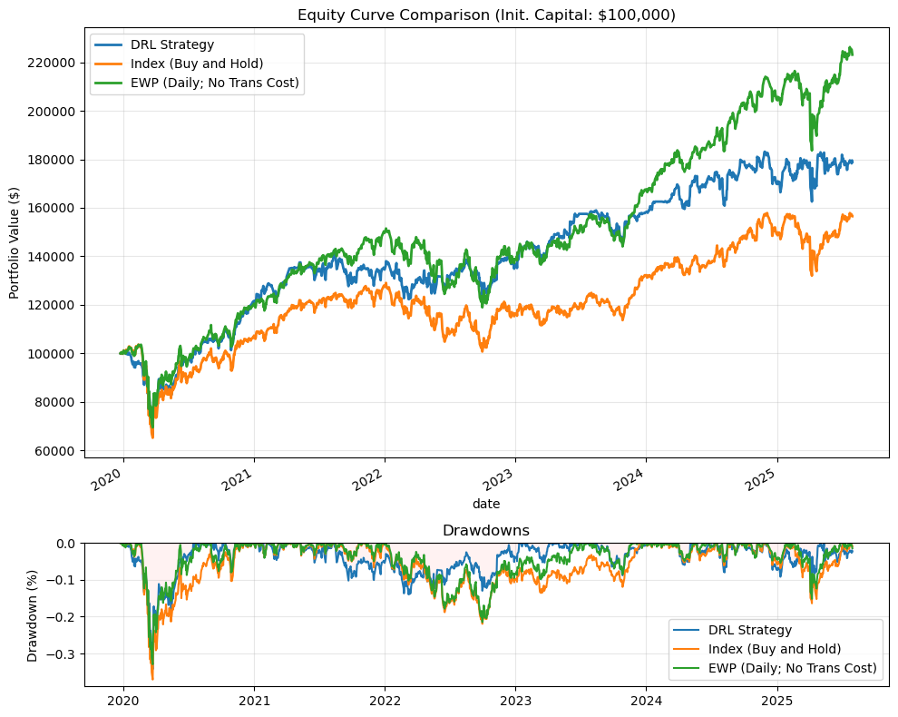
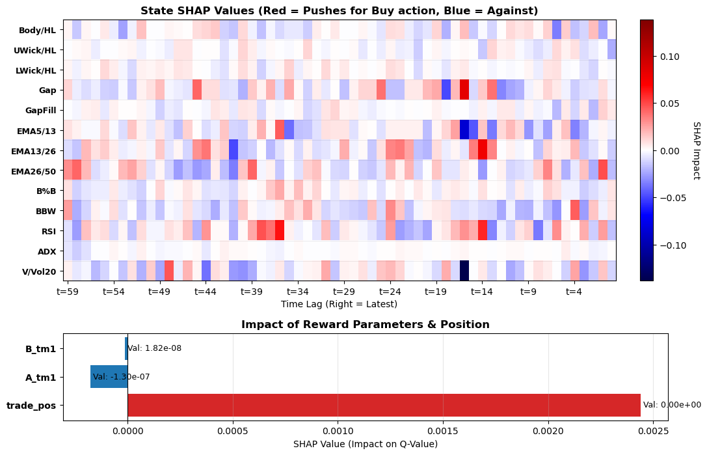

<a id="readme-top"></a>

<!-- PROJECT SHIELDS -->
[![Forks][forks-shield]][forks-url]
[![Stargazers][stars-shield]][stars-url]
[![Issues][issues-shield]][issues-url]
[![LinkedIn][linkedin-shield]][linkedin-url]


<!-- PROJECT LOGO -->
<br />
<div align="center">
  <a href="https://github.com/shh1v/ReinforceTrader">
    
  </a>

  <p align="center">
    <a href="https://github.com/shh1v/ReinforceTrader">View Demo</a>
    &middot;
    <a href="https://github.com/shh1v/ReinforceTrader/issues/new?labels=bug&template=bug-report---.md">Report Bug</a>
    &middot;
    <a href="https://github.com/shh1v/ReinforceTrader/issues/new?labels=enhancement&template=feature-request---.md">Request Feature</a>
  </p>
</div>


<!-- TABLE OF CONTENTS -->
<details>
  <summary>Table of Contents</summary>
  <ol>
    <li>
      <a href="#about-the-project">About The Project</a>
      <ul>
        <li><a href="#data-preprocessing">Data Preprocessing</a></li>
        <li><a href="#dueling-double-dqn-dddqn">Dueling Double DQN (DDDQN)</a></li>
        <li><a href="#state-and-reward-functions">State and Reward Functions</a></li>
        <li><a href="#model-training">Model Training</a></li>
        <li><a href="#backtesting">Backtesting</a></li>
        <li><a href="#explainability">Explainability</a></li>
      </ul>
    </li>
    <li>
      <a href="#getting-started">Getting Started</a>
      <ul>
        <li><a href="#prerequisites">Prerequisites</a></li>
        <li><a href="#installation">Installation</a></li>
      </ul>
    </li>
    <li><a href="#limitations">Limitations</a></li>
    <li><a href="#upcoming-features">Upcoming Features</a></li>
    <li><a href="#contributing">Contributing</a></li>
    <li><a href="#acknowledgments">Acknowledgments</a></li>
  </ol>
</details>


<!-- ABOUT THE PROJECT -->
## About The Project

This research project implements a complete Machine Learning workflow for an automated trading model. It features end-to-end data processing pipelines, efficient state representation for Walk-Forward Validation (WFV), and a custom Dual-Branch Dueling Double DQN architecture. Furthermore, the project includes an event-driven backtesting engine that accounts for realistic portfolio constraints such as transaction costs and dynamic position sizing. Finally, I implemented Explainable AI (XAI) tools, including Grad-CAM and SHAP, to interpret the feature contributions driving the agent's trading decisions.

### Data Preprocessing
The pipeline begins with fetching, cleaning, and validating market data, followed by feature engineering. The `RawDataLoader` class retrieves ticker data via the Yahoo Finance API. It supports fetching OHLCV data for composite indices (e.g., S&P 500, Dow Jones) by scraping constituent lists from sources like Wikipedia. To minimize API calls, the loader caches raw data locally and validates existing files before downloading. The `FeatureBuilder` class constructs the technical indicators used for RL state representation and reward computation, preparing the dataset for training through techniques such as rolling window standardization and rescaling.

### Dueling Double DQN (DDDQN)
We applied the Deep Q-Networks algorithm (DQN; [Mnih et al., 2013](https://doi.org/10.48550/arXiv.1312.5602)), a value-based RL algorithm designed for sequential decision-making problems like stock trading. The architecture, defined in the DualBranchDQN class, utilizes a dual-branch structure: a 1-D Convolutional Neural Network (CNN) branch processes the window of price state features, while a separate Multilayer Perceptron (MLP) branch processes reward-specific features (e.g., trade position, historical return moments).

The target value function is formulated using the Bellman equation. To address the substantial overestimation bias found in vanilla DQN, I implemented Double DQN (DDQN; [Hasselt et al., 2015](https://doi.org/10.48550/arXiv.1509.06461)). This splits action selection from evaluation by maintaining an `online` network for selecting actions and a `target` network for evaluating the Q-value:

$$Q(s, a)_{online} = R_{t+1} +Q_{target}(s\prime, \mathop{\mathrm{argmax}}_{a\prime} Q_{online}(s\prime, a\prime))$$

The target network weights are updated via Polyak soft updates. I also implemented the Dueling architecture ([Wang et al., 2016](https://doi.org/10.48550/arXiv.1511.06581)), which decouples the Q-value into two estimators: one for the state value function $V(s)$ and another for the state-dependent action advantage function $A(s, a)$. This enables faster and more reliable learning.

### State and Reward Functions
I implemented three distinct reward functions: the Differential Sharpe Ratio (DSR), the Differential Downside Deviation Ratio (DDDR), also known as the Differential Sortino Ratio ([Moody and Saffel, 2001](https://doi.org/10.1109/72.935097)), and simple Log Returns (PnL).

The equations for DSR and DDDR are derived by considering exponential moving averages of returns and standard deviation, expanded via a first-order Taylor series on the adaptation rate $\eta$. Let $A_t$ and $B_t$ be the first and second moments of returns, respectively. Let $S_t$ denote the Sharpe ratio. Then:

$$S_t = \frac{A_t}{\sqrt{B_t-A^{2}_t}}$$

Where $A_t = A_{t-1} + \eta(R_t-A_{t-1})$ and $B_t = B_{t-1} + \eta(R^2_t - B_{t-1})$


The first-order expansion gives:

$$
S_t \big|_{\eta > 0} \approx S_{t-1} + \eta \frac{d S_t}{d \eta} \bigg|_{\eta = 0} + \mathcal{O}(\eta^2)
$$

Using the chain rule, we find that:

$$
D_t = \frac{d S_t}{d \eta}
= \frac{B_{t-1}\,\Delta A_t - \tfrac{1}{2} A_{t-1}\,\Delta B_t}
{\left(B_{t-1} - A_{t-1}^2\right)^{3/2}}
$$

Where $\Delta A_t = R_t - A_{t-1}$ and $\Delta B_t = R^2_t-B_{t-1}$. $D_t$, representing the DSR, essentially measures the *sensitivity* of the Sharpe ratio to the return.

Similarly, the DDDR is computed as follows:

$$
D_t \equiv \frac{d\,\mathrm{DDR}_t}{d\eta} =
\begin{cases}
\frac{R_t - \frac{1}{2} A_{t-1}}{\mathrm{DD}_{t-1}}, & R_t > 0, \\
\frac{\mathrm{DD}_{t-1}^2 \left(R_t - \frac{1}{2} A_{t-1}\right) - \frac{1}{2} A_{t-1} R_t^2}{\mathrm{DD}_{t-1}^3}, & R_t \le 0.
\end{cases}
$$

Where $A_t = A_{t-1} + \eta \left(R_t - A_{t-1}\right)$ and
$\mathrm{DD}\_t^2 = \mathrm{DD}\_{t-1}^2 + \eta (\min\{R\_t, 0\}^2 - \mathrm{DD}\_{t-1}^2)$.

In practice, recursive functions like DSR and DDDR require initial parameter estimates for $A_t$ or $DD_t$. These are initialized (hot-started) using a subset of data kept out of the training set (as outlined on [QFSE](https://quant.stackexchange.com/questions/42665/how-to-calculate-differential-sharpe-ratio)). See `DRLAgent` for implementation details.

### Model Training
The `EpisodeStateLoader` class prepares the state representation for every episode. Episodes are constructed based on Walk-Forward Validation (WFV), supporting both `moving` and `expanding` window modes.

Training is managed by the `DRLAgent` class, which maintains an experience replay memory buffer. Training steps are performed by randomly sampling batches from this buffer. Hyperparameters are set via a config at the `train()` call, supporting features such as epsilon boosting and experience replay start lags. I also perform post-episode validation steps to generate visualizations (e.g., cumulative reward trajectories) and compute performance metrics for the validation window, such as hit rate and profit factor.

<div align="center">
  
  <br>
  <b>Fig 1. Training and validation measures after each episode.</b>
</div>

I trained the DDDQN model with the DSR reward function for multiple rounds, iterating through WFV windows, and observed the following loss progression.

<div align="center">
  
  <br>
  <b>Fig 2. Overall training and validation losses with epsilon values.</b>
</div>

### Backtesting
I implemented a custom event-driven backtester using the `EDBacktester` class. While many Python libraries exist for backtesting, I developed a custom engine specifically catered to RL agents. This allowed me to account for real-time position sizing, cash management, and portfolio constraints while enabling direct comparison against benchmarks like Equal-Weighted Portfolios (EWP) and Buy-and-Hold strategies. The engine also generates trade scenario visualizations to investigate specific agent behaviors during entry and exit points. This data is subsequently used by the explainability modules.

<div align="center">
  
  <br>
  <b>Fig 3. Portfolio value versus benchmarks and corresponding drawdowns.</b>
</div>


### Explainability
By treating the DQN as a classification task where action selection maximizes the reward function, I implemented the Grad-CAM method (see `ModelExplainer`) on the final convolutional layer of the CNN branch. Grad-CAM highlights the spatial regions (time steps) in the input window that strongly influenced a specific outcome, such as a `Buy` signal. It computes the weighted sum of feature maps in the CNN layer, where weights are determined by the average gradients of the target class score w.r.t. the feature maps.

$$L^c_{\mathrm{Grad-CAM}} = \mathrm{ReLU}(\sum_k{a^c_kA^k})$$

Where $a^c_k$ is the weight of the $k^{\mathrm{th}}$ feature map for prediction class $c$, and $A^k$ is the $k^{\mathrm{th}}$ feature map.

<div align="center">
  
  <br>
  <b>Fig 4. Grad-CAM visualization of state features and their importance scores over time for an MCD trade.</b>
</div>

Grad-CAM has limitations, particularly with noisy financial data where visual explanations can be ambiguous and misleading. It primarily identifies *where* the model is looking but not necessarily *how* specific features contribute to the decision. To address this, I also implemented the SHAP method using the `GradientExplainer` from the `shap` library. This method quantifies the marginal contribution of each feature to the individual prediction.

<div align="center">
  
  <br>
  <b>Fig 5. SHAP values visualization of state and reward features over time for an MCD trade.</b>
</div>

<p align="right">(<a href="#readme-top">back to top</a>)</p>


<!-- GETTING STARTED -->
## Getting Started

This section outlines how to install dependencies and run the Jupyter notebooks that demonstrate how to use and further develop ReinforceTrader.

### Prerequisites

1. Conda: These instructions assume you are using a Conda environment manager (Anaconda, Miniconda, or Miniforge).

2. Hardware: Ensure you have a supported NVIDIA graphics card (see the list [here](https://developer.nvidia.com/cuda/gpus)).

3. Windows Users: Because TensorFlow 2.10+ no longer natively supports GPU acceleration on Windows, you must run this project using WSL2 (Windows Subsystem for Linux). For step-by-step installation instructions, please refer to the [TensorFlow WSL2 guide](https://www.tensorflow.org/install/pip?_gl=1*swj26s*_up*MQ..*_ga*OTU0MDE4MDc1LjE3NjcwMDY2MzM.*_ga_W0YLR4190T*czE3NjcwMDY2MzIkbzEkZzAkdDE3NjcwMDY2MzIkajYwJGwwJGgw#windows-wsl2).

### Installation


1. Clone the repo
   ```sh
   git clone https://github.com/shh1v/ReinforceTrader
   cd ReinforceTrader
   ```
2. Create the Conda Environment (`RTenv`)
   ```sh
   conda env create -f environment.yml
   ```
   **Note:** Please create an issue in this repository if you encounter any problems installing dependencies.
   ```sh
   conda activate RTenv
   ```
4. Run the Notebooks
   ```sh
   cd notebooks
   jupyter lab
   ```
5. Change git remote url to avoid accidental pushes to base project
   ```sh
   git remote set-url origin github_username/repo_name
   git remote -v # confirm the changes
   ```

<p align="right">(<a href="#readme-top">back to top</a>)</p>

<!-- Limitations -->
## Limitations

The following limitations should be considered when evaluating the current performance and generalization capabilities of the model:

1. The current state space relies exclusively on price-derived technical features. A more robust agent would likely require a multi-modal approach, incorporating fundamental data, macroeconomic indicators, or sentiment analysis to capture a holistic view of the market environment.
2. The model was trained on the `Dow Jones 30` index constituents from 2000–2020. While sufficient for a proof-of-concept, modern RL applications in finance typically benefit from significantly larger and more diverse datasets (e.g., Russell 3000, global indices) to improve generalization. Scaling the data was constrained by available computational resources.
3. The current reward functions and backtester assume execution at the closing price without slippage. In a live trading environment, market impact and slippage—particularly for larger position sizes—would materially affect net returns. Future iterations should incorporate a slippage model to better reflect market microstructure realities.
4. The implemented XAI tools (Grad-CAM and SHAP) provide valuable initial insights but exhibit sensitivity to initialization parameters. For instance, the `GradientExplainer` shows high variance in SHAP values depending on the `rseed`, a known challenge when applying perturbation-based explainability methods to finanacial time-series data.

<p align="right">(<a href="#readme-top">back to top</a>)</p>

<!-- ROADMAP -->
## Upcoming Features

- [ ] Implement multi-step learning for DQN to improve convergence speed and better handle the noisy reward signals inherent in financial time series.
- [ ] Expand the state space to include alternative data sources, such as market sentiment analysis and geopolitical news indicators, to capture broader market dynamics.
- [ ] Develop and test composite reward functions that simultaneously optimize for multiple objectives, such as minimizing drawdowns while maximizing excess returns.
- [ ] Implement a live paper-trading environment using the Interactive Brokers (IBKR) API to validate strategy performance in real-time market conditions.

<p align="right">(<a href="#readme-top">back to top</a>)</p>

<!-- ACKNOWLEDGMENTS -->
## Acknowledgments

Here is a list of resources I found helpful:

* [Learning to Trade with Reinforcement Learning](https://dennybritz.com/posts/wildml/learning-to-trade-with-reinforcement-learning/)
* [Explainable AI for Computer Vision](https://adataodyssey.com/course/)
* [Rainbow DQN](https://doi.org/10.48550/arXiv.1710.02298)
* [Udacity AI Trading Strategies (Paid)](https://www.udacity.com/course/ai-trading-strategies--nd881)

<p align="right">(<a href="#readme-top">back to top</a>)</p>


<!-- MARKDOWN LINKS & IMAGES -->
<!-- https://www.markdownguide.org/basic-syntax/#reference-style-links -->
[forks-shield]: https://img.shields.io/github/forks/shh1v/ReinforceTrader.svg?style=for-the-badge
[forks-url]: https://github.com/shh1v/ReinforceTrader/network/members
[stars-shield]: https://img.shields.io/github/stars/shh1v/ReinforceTrader.svg?style=for-the-badge
[stars-url]: https://github.com/shh1v/ReinforceTrader/stargazers
[issues-shield]: https://img.shields.io/github/issues/shh1v/ReinforceTrader.svg?style=for-the-badge
[issues-url]: https://github.com/shh1v/ReinforceTrader/issues
[license-shield]: https://img.shields.io/github/license/shh1v/ReinforceTrader.svg?style=for-the-badge
[license-url]: https://github.com/shh1v/ReinforceTrader/blob/doc/readme/LICENSE
[linkedin-shield]: https://img.shields.io/badge/-LinkedIn-black.svg?style=for-the-badge&logo=linkedin&colorB=555
[linkedin-url]: https://linkedin.com/in/sh1v